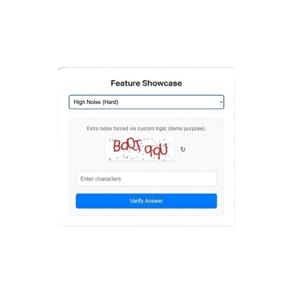

# Advanced PHP Captcha

**PHP Captcha** is an elegant, highly customizable, and secure captcha generator for PHP 8.0+. It supports advanced features like wave distortion, mathematical challenges, granular noise control, and custom font management.

Designed to be simple to use but powerful enough for any security requirement.



## Requirements

- PHP 8.0 or higher
- GD Extension (`ext-gd`)

## Features

- **Highly Customizable:** Control colors, fonts, noise, lines, and distortion.
- **Math Mode:** Present users with simple arithmetic verification (e.g., `5 + 3`).
- **Wave Distortion:** Advanced warp algorithms to defeat OCR bots.
- **Font Management:** Use a specific font or randomize from a directory.
- **Multiple Outputs:** Stream directly to browser, get Base64, or save to disk.
- **Zero Dependencies:** Requires only standard PHP GD extension.

## Installation

You can install the package via composer:

```bash
composer require olakunlevpn/phpcapcha
```

## Basic Usage

Here is the quickest way to get a captcha up and running:

```php
use Olakunlevpn\Captcha\Captcha;

session_start();

// Initialize
$captcha = new Captcha();

// Generate and Output an Image (200x70)
$captcha->create()->output();

// Store the code in session for validation later
$_SESSION['captcha_code'] = $captcha->getCode();
```

## Advanced Usage

### Customizing Appearance

You can chain methods to configure the captcha exactly how you want it.

```php
use Olakunlevpn\Captcha\Captcha;

$captcha = new Captcha();

$captcha->setFont(__DIR__ . '/fonts/Monaco.ttf') // Or pass a directory for random font
        ->setTextColor(40, 40, 40)               // Dark Grey Text
        ->setBackgroundColor(240, 240, 240)      // Light Grey Background
        ->setLength(5)                           // 5 Characters
        ->setType('alpha')                       // Alphabetic only (no numbers)
        ->create(250, 80);                       // Create with specific dimensions

$captcha->output();
```

### Math Challenge Mode

Instead of asking users to read distorted text, ask them to solve a simple math problem.

```php
$captcha = new Captcha();

// Set type to 'math'
$captcha->setType('math');

$image = $captcha->create();

// The code will be the result (e.g., if image shows "5 + 3", code is "8")
$result = $captcha->getCode();

$captcha->output();
```

### Granular Noise & Distortion Control

You have full control over the security elements.

```php
$captcha = new Captcha();

// Enable/Disable specific elements
$captcha->setNoise(true, 100)      // Enabled, 100 dots
        ->setLines(true, 5)        // Enabled, 5 random lines
        ->setDistortion(true, 5, 40) // Enabled, Amplitude 5, Period 40
        ->create();
```

To create a **Clean** captcha (easier for humans, less secure against bots):

```php
$captcha->setNoise(false)
        ->setLines(false)
        ->setDistortion(false)
        ->create();
```

### Saving to File

Useful for caching or generating static assets.

```php
$captcha->create();
$captcha->save(__DIR__ . '/captchas/image_123.png');
```

### Inline Base64

Useful for passing the image directly to a view or API response without a separate endpoint.

```php
$captcha->create();
$base64 = $captcha->getBase64();

echo '';
```

## Validation

Validation is straightforward. Simply compare the user's input against the stored code.

```php
session_start();

$input = $_POST['captcha']; // User input
$stored = $_SESSION['captcha_code']; // Stored from generation

// Use case-insensitive comparison for text
if (strtolower($input) === strtolower($stored)) {
    echo "Verification Successful!";
} else {
    echo "Incorrect Code.";
}
```

## API Reference

| Method                                               | Description                                                               |
| :--------------------------------------------------- | :------------------------------------------------------------------------ |
| `setFont(string $path)`                              | Path to a `.ttf` file OR a directory containing fonts (random selection). |
| `setTextColor(int $r, int $g, int $b)`               | Sets the RGB color of the text.                                           |
| `setBackgroundColor(int $r, int $g, int $b)`         | Sets the RGB color of the background.                                     |
| `setLength(int $length)`                             | Number of characters to generate (ignored in Math mode).                  |
| `setType(string $type)`                              | `mixed` (default), `alpha`, `numeric`, or `math`.                         |
| `setNoise(bool $enable, int $count)`                 | Toggle dots noise and set quantity.                                       |
| `setLines(bool $enable, int $count)`                 | Toggle random lines and set quantity.                                     |
| `setDistortion(bool $enable, int $amp, int $period)` | Toggle wave distortion. Amplitude/Period control wave shape.              |
| `create(int $width, int $height)`                    | Generates the image resource. Must be called before output.               |
| `output()`                                           | Headers + Image binary stream (PNG).                                      |
| `getBase64()`                                        | Returns Base64 encoded string of the image.                               |
| `save(string $path)`                                 | Saves the image to the specified file path.                               |
| `getCode()`                                          | Returns the correct answer/code for validation.                           |

## Examples

Check the `examples/` directory for full implementations:

- **Vanilla CSS** (`examples/vanilla-css.php`)
- **Tailwind CSS** (`examples/tailwind.php`)
- **Bootstrap 5** (`examples/bootstrap.php`)
- **jQuery/AJAX** (`examples/jquery.php`)

## AI assistant integration

This repository includes an `AGENTS.md` file specifically designed for AI assistants (like GitHub Copilot, Cursor, or Claude). If you're using an AI tool to help with your Laravel project:

- **Point your AI assistant to the AGENTS.md file** when asking about `phpcapcha` optimization.
- The file contains detailed guidance for analyzing components and determining eligibility.
- **Use it for automated analysis** - AI assistants can help audit your entire component library.

**Example prompts for AI assistants:**

- "Using the `AGENTS.md` file, analyze my components and tell me which can use `phpcapcha`"
- "Help me add `phpcapcha` to all eligible components following the guidelines"
- "Check if this component is safe for captcha protection based on `AGENTS.md`"

## License

The MIT License (MIT). Please see [License File](LICENSE.md) for more information.
